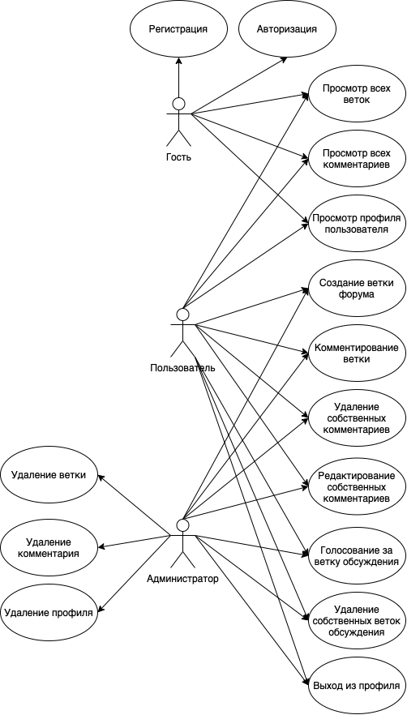
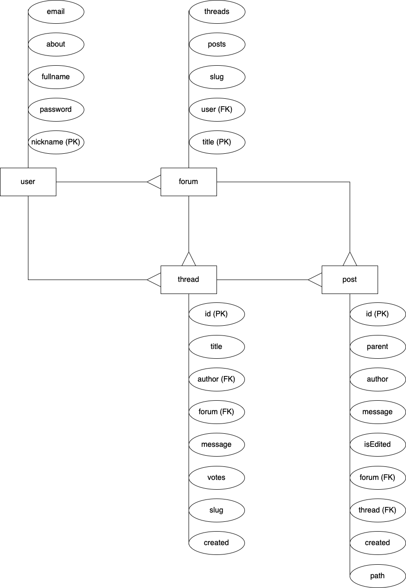

# Цель работы, решаемая проблема/предоставляемая возможность.
Форум обсуждения новостей о программировании

# Краткий перечень функциональных требований.
### Форум
* Создание форума
* Получение информации о форуме

### Ветка
* Создание ветки
* Получение информации о ветке обсуждения
* Обновление ветки
* Получение сообщений данной ветви обсуждения
* Проголосовать за ветвь обсуждения

### Пользователь
* Создание пользователя
* Получение информации о пользователях данного форума
* Изменение данных о пользователе
* Получение информации о пользователе

### Посты
* Создание новых постов
* Изменение сообщения в посте

### Другое
* Получение информации о базе данных
* Очистка всех данных в базе

# Use-case диаграмма системы.

# ER-диаграмма сущностей системы.

